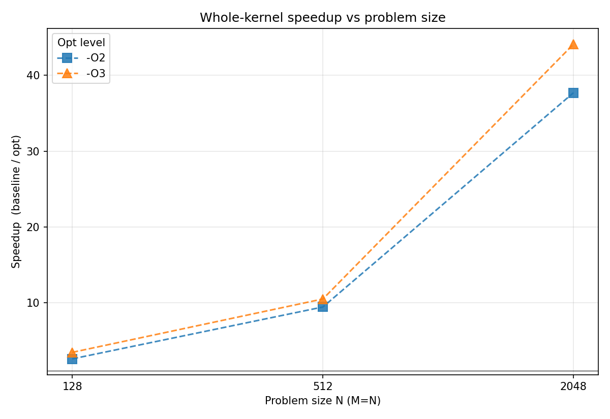

# Optimizing PolyBench `correlation` — a human-AI engineering collaboration

> I directed an AI coding assistant through a full performance-engineering cycle —
> profile, diagnose, transform, verify — while I owned the ideation and judgment calls.
> The result: a **44× speedup** on the PolyBench `correlation` kernel,
> **bit-identical** to the upstream output, achieved entirely within the
> function-body constraint.



This repo is a case study in **how I work with AI on hard systems problems**, backed
by the artifacts that prove the workflow produces real engineering. The AI wrote
every line of C and Python here; I set the direction, ruled on trade-offs, and
caught the errors. Neither half would have produced this result alone — and the
[process writeup](docs/process.md) is honest about exactly which contributions came
from where.

---

## The three things this project demonstrates

### 1. Human-AI teaming  →  [`docs/process.md`](docs/process.md)
A documented account of the collaboration: where my judgment overrode AI proposals
(rejecting a numerically-unsafe single-pass variance), where my ideas the AI didn't
have became the foundation (the in-kernel transpose), and where the AI moved faster
than I could (deriving cache budgets, writing the measurement harness). The honest
version — including what the AI got wrong and where it doesn't know when to stop.

### 2. Performance engineering  →  [`docs/optimization.md`](docs/optimization.md) · [`kernel/correlation.opt.c`](kernel/correlation.opt.c)
The kernel was memory-bound and unvectorizable because three of its four loops walk
columns of a row-major array. Diagnosed with hardware counters, then fixed with three
transformations, all inside `kernel_correlation`:
- **In-kernel blocked transpose** — makes every inner loop unit-stride (the foundation).
- **Column-at-a-time fusion** of the stats + centering passes — halves DRAM traffic.
- **Register-blocking + backward-`j`** on the hot O(M²N) loop — saturates the AVX2 FMA units.

Measured at the microarchitecture level: region 4's L3 miss rate drops 79% → 28% and
FLOPs/cycle rises 0.04 → 1.75 at N=2048. Methodology in [`docs/profiling.md`](docs/profiling.md).

### 3. Software design  →  [`framework/`](framework/)
A small, declarative, reusable experiment harness ([`experiment_helper.py`](framework/experiment_helper.py))
that drives the whole study: define a parameter sweep, it compiles every combination in
parallel (MD5-fingerprinted build cache), runs them round-robin to avoid time-bias,
checkpoints to CSV, and resumes after interruption. A `HWCounterStudy` subclass adds
PAPI counters with user-defined derived metrics. Design notes in [`framework/framework.md`](framework/framework.md).

---

## The result

Whole-kernel speedup, `-O3`, trimmed mean of 10 runs (M = N):

| Size | Baseline | Optimized | Speedup |
|-----:|---------:|----------:|--------:|
| 128  | 1.10 ms  | 0.32 ms   | 3.46×   |
| 512  | 175.8 ms | 16.8 ms   | 10.5×   |
| 2048 | 46.3 s   | 1.05 s    | **44.1×** |

The speedup grows with N because the baseline's strided access pattern degrades faster
than the O(M²N) work increases — so the locality fixes pay off proportionally more at scale.

## Repository map

```
kernel/      The optimized kernel (correlation.opt.c) + instrumented baseline
docs/        Narrative: process.md, optimization.md, profiling.md + formal report (PDF)
framework/   The reusable experiment/measurement harness (software-design pillar)
study/       Drivers + analysis scripts for this specific case study
results/      Final CSVs and the plots used in the report
```

## Reproducing it

Requires Python 3 (pandas, numpy, matplotlib), GCC, and — for the counter studies — PAPI.
The [PolyBench/C 4.2.1](https://github.com/MatthiasJReisinger/PolyBenchC-4.2.1) suite must
be unpacked at `polybench-c-4.2.1-beta/` (it is not vendored here). All commands run from
the repo root:

```bash
python3 study/check_correctness.py opt   # verify opt kernel is bit-identical to upstream
./study/run_all.sh                        # full runtime + counter sweep -> build/*/results_*.csv
python3 study/analyze_speedup.py          # regenerate results/speedup_vs_size.png + table
```

## The formal report

The full academic writeup, including the GenAI-usage discussion from both the AI's and my
perspective, is in [`docs/CS553_homework_4.pdf`](docs/CS553_homework_4.pdf) (source: `docs/report.tex`).
